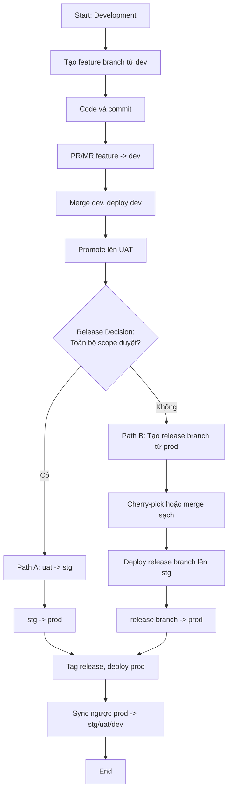

# Team Git Flow & Release Management Standard

| Thông tin         | Giá trị                                                                     |
| ----------------- | --------------------------------------------------------------------------- |
| Tài liệu          | Team Git Flow & Release Management Standard                                 |
| Mục đích          | Chuẩn hóa quy trình phát triển, kiểm thử và release code qua các môi trường |
| Đối tượng áp dụng | Developer, Tech Lead, QA, BA/PO, DevOps/Release Owner                       |
| Phạm vi           | Feature, bugfix, hotfix, release branch, merge request và CI/CD             |
| Trạng thái        | Draft for team review                                                       |
| Phiên bản         | 1.0                                                                         |

## 1. Tổng quan

Tài liệu này định nghĩa Git flow chuẩn cho team khi phát triển một module/feature từ lúc bắt đầu code đến khi release production.

Flow tiêu chuẩn:

```text
feature/* -> dev -> uat -> stg -> prod
```

Mục tiêu chính của tài liệu là đảm bảo:

- Thành viên mới hiểu rõ checkout branch nào, tạo branch từ đâu, PR/MR vào đâu.
- Code đi qua đúng các môi trường kiểm thử trước khi lên production.
- Không kéo nhầm feature chưa được duyệt vào production.
- Có cách xử lý rõ ràng khi nhiều feature phát triển song song nhưng không release cùng lúc.
- Có guideline thống nhất cho hotfix, rollback, tagging và đồng bộ branch sau release.

## 2. Branch và môi trường

### 2.1 Branch môi trường

| Branch | Môi trường deploy       | Mục đích                                                  | Người duyệt chính                      |
| ------ | ----------------------- | --------------------------------------------------------- | -------------------------------------- |
| `dev`  | Development             | Tích hợp code mới, test kỹ thuật, test tích hợp sớm       | Developer/Tech Lead                    |
| `uat`  | User Acceptance Testing | QA/BA/PO test nghiệp vụ và acceptance criteria            | QA, BA/PO                              |
| `stg`  | Staging                 | Release candidate, regression/smoke test trước production | QA, Tech Lead, Release Owner           |
| `prod` | Production              | Code chính thức đang chạy cho người dùng cuối             | Tech Lead/Release Owner/Business Owner |

> Nếu repository đang dùng tên khác như `develop`, `staging`, `main` hoặc `master`, team cần mapping rõ ràng:
>
> - `develop` tương đương `dev`
> - `staging` tương đương `stg`
> - `main` hoặc `master` tương đương `prod`

### 2.2 Branch làm việc

| Loại branch             | Format                             | Ví dụ                                 | Tạo từ                                 |
| ----------------------- | ---------------------------------- | ------------------------------------- | -------------------------------------- |
| Feature                 | `feature/<ticket-id>-<short-name>` | `feature/ABC-123-payment-method`      | `dev`                                  |
| Bugfix trước production | `bugfix/<ticket-id>-<short-name>`  | `bugfix/ABC-456-fix-login-validation` | `dev` hoặc branch môi trường liên quan |
| Promote/UAT candidate   | `promote/<ticket-id>-to-uat`       | `promote/ABC-123-to-uat`              | `uat` hoặc baseline được thống nhất    |
| Hotfix production       | `hotfix/<ticket-id>-<short-name>`  | `hotfix/ABC-999-fix-prod-timeout`     | `prod`                                 |
| Release                 | `release/<version-or-scope>`       | `release/2026-04-21-payment`          | `prod`                                 |

## 3. Vai trò và trách nhiệm

| Vai trò              | Trách nhiệm                                                                                                |
| -------------------- | ---------------------------------------------------------------------------------------------------------- |
| Developer            | Tạo branch đúng chuẩn, commit rõ ràng, mở PR/MR, xử lý comment review, đảm bảo test cơ bản trước khi merge |
| Reviewer/Tech Lead   | Review code, kiểm tra thiết kế kỹ thuật, kiểm soát rủi ro merge nhầm feature                               |
| QA                   | Test trên `dev`, `uat`, `stg` theo phạm vi được thông báo                                                  |
| BA/PO                | Xác nhận nghiệp vụ, acceptance criteria và quyết định feature nào được release                             |
| DevOps/Release Owner | Quản lý CI/CD, tag release, deploy, rollback và kiểm soát lịch release                                     |

## 4. Nguyên tắc bắt buộc

1. Không commit trực tiếp vào `dev`, `uat`, `stg`, `prod`.
2. Mọi thay đổi phải đi qua Pull Request/Merge Request.
3. Feature branch mặc định tạo từ `dev`.
4. Hotfix production phải tạo từ `prod`.
5. Không merge nguyên một branch môi trường lên branch cao hơn nếu branch đó chứa feature chưa được duyệt release.
6. Khi chỉ release một phần code, phải dùng release branch tạo từ `prod` hoặc cherry-pick có kiểm soát.
7. Production release phải có approval rõ ràng, tag/version rõ ràng và rollback plan.
8. Sau khi release production hoặc hotfix production, phải đồng bộ ngược `prod` về các branch môi trường thấp hơn.
9. Trước khi deploy staging cho một release, phải xác nhận `stg` không chứa thay đổi ngoài scope release.

## 5. Quy trình end-to-end thống nhất

Quy trình này áp dụng cho cả trường hợp release một feature đơn lẻ và nhiều feature phát triển song song. Điểm khác nhau không nằm ở việc developer tạo branch từ đâu, mà nằm ở quyết định release sau khi UAT: release toàn bộ scope đang có hay chỉ release chọn lọc một phần.

Nguyên tắc nền:

- Feature branch mặc định tạo từ `dev` để phục vụ development hằng ngày.
- `prod` là source of truth cho production baseline. Trong một số repository, `prod` có thể được đặt tên là `main` hoặc `master`.
- Mọi code được go-live cuối cùng phải vào lại `prod`.
- Khi release chọn lọc, release branch phải tạo từ `prod` để tránh kéo theo code chưa được duyệt.

Ví dụ:

- Feature A: `ABC-123 Payment Method`
- Feature B: `ABC-456 Loyalty Point`

### 5.1 Development: tạo feature branch từ `dev`

Developer checkout từ `dev`:

```bash
git checkout dev
git pull origin dev
git checkout -b feature/ABC-123-payment-method
```

Sau khi code:

```bash
git add .
git commit -m "ABC-123 add payment method"
git push origin feature/ABC-123-payment-method
```

Tạo PR/MR:

```text
feature/ABC-123-payment-method -> dev
```

Điều kiện merge vào `dev`:

- CI build pass.
- Unit test pass nếu có.
- Không có secret/config local bị commit.
- Code được review.
- Branch đã cập nhật với `dev` mới nhất nếu cần.

Sau khi merge, CI/CD deploy branch `dev` lên môi trường Development.

Mục tiêu ở `dev`:

- Developer test tích hợp.
- QA test nhanh nếu team có quy trình QA trên `dev`.
- Phát hiện lỗi kỹ thuật sớm.

### 5.2 Promote lên UAT

Khi feature đã ổn ở Development, đưa code lên UAT để QA/BA/PO test nghiệp vụ.

Nếu toàn bộ thay đổi trên `dev` đều được phép lên UAT:

```text
dev -> uat
```

Nếu `dev` đang chứa nhiều feature nhưng chỉ một số feature được phép lên UAT, không merge nguyên `dev`. Khi đó dùng một trong các hướng sau:

- Tạo branch promote từ `uat`, rồi cherry-pick đúng commit cần đưa lên UAT.
- Tạo branch `promote/<ticket-id>-to-uat` từ baseline đã thống nhất với Release Owner, rồi chỉ đưa các commit thuộc scope UAT vào branch đó.
- Dùng feature flag nếu code có thể deploy nhưng chưa bật tính năng.

Mục tiêu ở `uat`:

- QA test nghiệp vụ.
- BA/PO xác nhận acceptance criteria.
- Ghi nhận bug hoặc change request nếu có.
- Xác định feature hoặc release scope có đủ điều kiện go-live hay không.

### 5.3 Release decision point

Sau khi UAT pass/sign-off, Release Owner và BA/PO cần xác định release scope trước khi đưa code lên Staging.

| Câu hỏi                                             | Nếu câu trả lời là Có                   | Nếu câu trả lời là Không                                            |
| --------------------------------------------------- | --------------------------------------- | ------------------------------------------------------------------- |
| Toàn bộ thay đổi trên `uat` đều được duyệt go-live? | Đi theo Path A: promote toàn bộ scope   | Đi theo Path B: release chọn lọc                                    |
| `stg` đang sạch hoặc chỉ chứa scope release?        | Có thể dùng `stg` cho release candidate | Deploy trực tiếp release branch lên Staging hoặc chuẩn bị lại `stg` |
| Feature branch cần merge vào release có sạch không? | Có thể cân nhắc merge feature branch    | Ưu tiên cherry-pick hoặc dựng lại branch sạch từ `prod`             |

### 5.4 Path A: toàn bộ scope được duyệt release

Dùng path này khi mọi thay đổi trên `uat` đều nằm trong scope release và được duyệt go-live.

Tạo PR/MR:

```text
uat -> stg
```

Điều kiện:

- UAT pass/sign-off.
- `uat` chỉ chứa thay đổi nằm trong scope release.
- `stg` đang sạch hoặc chỉ chứa scope release.

Nếu `stg` đang chứa thay đổi ngoài scope release, không merge thêm release mới vào `stg` vì Git merge sẽ không tự loại bỏ các commit đã có sẵn trên `stg`. Release Owner cần đưa `stg` về baseline sạch theo quy trình được duyệt, hoặc cấu hình CI/CD để deploy trực tiếp release branch.

Mục tiêu ở `stg`:

- Regression test.
- Smoke test.
- Kiểm tra cấu hình gần production.
- Kiểm tra migration, job, cron, queue, third-party integration nếu có.
- Chốt release note và rollback plan.

Khi Staging pass:

```text
stg -> prod
```

Sau khi merge vào `prod`, tạo tag release:

```bash
git checkout prod
git pull origin prod
git tag v2026.04.21
git push origin v2026.04.21
```

CI/CD deploy `prod` hoặc tag release lên Production.

### 5.5 Path B: release chọn lọc một phần

Dùng path này khi `dev` hoặc `uat` đang chứa nhiều feature, nhưng chỉ một hoặc một số feature được duyệt go-live.

Ví dụ:

```text
uat = Feature A + Feature B
```

Yêu cầu:

- Feature A được lên Production.
- Feature B chỉ dừng ở UAT, chưa được lên Production.

Không được merge:

```text
uat -> stg
stg -> prod
```

Lý do: `uat` đang chứa cả Feature A và Feature B. Nếu merge nguyên `uat`, Feature B sẽ bị kéo lên Staging và có nguy cơ lên Production.

Flow đúng:

```text
prod -> release/ABC-123-payment-method -> stg (sạch) -> prod
```

Tạo release branch từ `prod`:

```bash
git checkout prod
git pull origin prod
git checkout -b release/ABC-123-payment-method
```

Release branch phải bao gồm toàn bộ commit cần thiết của Feature A, bao gồm cả commit fix bug phát sinh trong UAT nếu có.

### 5.6 Đưa code vào release branch

#### Cách 1: Cherry-pick commit

Ưu tiên cách này khi release chọn lọc.

```bash
git checkout release/ABC-123-payment-method
git cherry-pick <commit-feature-a-1>
git cherry-pick <commit-feature-a-2>
```

#### Cách 2: Merge feature branch vào release branch

Chỉ dùng khi `feature/ABC-123-payment-method` còn sạch và không chứa commit của feature khác.

Lưu ý: Chỉ dùng cách này nếu developer không merge/pull ngược `dev`, `uat`, `stg` hoặc branch môi trường khác vào feature branch. Nếu feature branch từng được cập nhật bằng cách merge/pull từ `dev` hoặc `uat`, branch đó có thể đã chứa lịch sử của các feature khác chưa được duyệt release. Khi đó không merge trực tiếp feature branch vào release branch; ưu tiên Cách 1 (Cherry-pick) hoặc tạo lại branch sạch từ `prod` rồi chỉ đưa đúng commit của feature cần release vào.

```bash
git checkout release/ABC-123-payment-method
git merge --no-ff feature/ABC-123-payment-method
```

#### Cách 3: Feature flag

Dùng khi code của feature chưa release có thể deploy nhưng chưa bật cho user.

Điều kiện:

- Feature chưa release phải được bảo vệ bằng feature flag.
- Flag mặc định tắt trên `stg` và `prod`.
- QA xác nhận code bị tắt không ảnh hưởng flow hiện tại.
- Release note ghi rõ flag nào được bật/tắt.
- Có owner chịu trách nhiệm bật/tắt flag và rollback flag sau release.

### 5.7 Staging và Production cho release chọn lọc

Trước khi dùng `stg`, phải xác nhận `stg` đang sạch hoặc chỉ chứa code thuộc release scope. Nếu `stg` đã chứa Feature B hoặc feature khác, không merge `release/ABC-123-payment-method -> stg` vì Feature B vẫn sẽ nằm trên `stg`.

Nếu `stg` sạch và Staging deploy từ branch `stg`:

```text
release/ABC-123-payment-method -> stg
stg -> prod
```

Nếu `stg` không sạch:

```text
Deploy release/ABC-123-payment-method directly to Staging
release/ABC-123-payment-method -> prod
```

### 5.8 Sync ngược sau release

Sau khi release lên Production, đồng bộ ngược:

```text
prod -> stg
prod -> uat
prod -> dev
```

Việc đồng bộ ngược giúp các branch môi trường không bị lệch lịch sử Production.

Lưu ý: Sync ngược là thao tác đưa production fix/release commit về branch thấp hơn. Sync ngược không có nghĩa là xóa các feature chưa release đang tồn tại trên `dev`, `uat` hoặc `stg`.

### 5.9 Sơ đồ quy trình

Dưới đây là sơ đồ tổng quát cho quy trình end-to-end từ development đến production:



## 6. Hotfix production

Hotfix dùng khi production có lỗi cần xử lý gấp.

### 6.1 Tạo hotfix branch

Hotfix phải tạo từ `prod`:

```bash
git checkout prod
git pull origin prod
git checkout -b hotfix/ABC-999-fix-prod-timeout
```

Sau khi sửa:

```bash
git add .
git commit -m "ABC-999 fix production timeout"
git push origin hotfix/ABC-999-fix-prod-timeout
```

### 6.2 PR/MR hotfix vào production

Tạo PR/MR:

```text
hotfix/ABC-999-fix-prod-timeout -> prod
```

Điều kiện release hotfix:

- Root cause hoặc phạm vi lỗi đã được xác định.
- Fix đã được review.
- Có test tối thiểu hoặc manual verification.
- Có rollback plan.

### 6.3 Đồng bộ ngược sau hotfix

Sau khi hotfix lên production, phải merge/cherry-pick ngược về:

```text
prod -> stg
prod -> uat
prod -> dev
```

Nếu không đồng bộ ngược, lỗi đã fix ở production có thể xuất hiện lại trong release sau.

## 7. Rollback guideline

Rollback phải được chuẩn bị trước khi release production.

### 7.1 Rollback bằng tag/version

Nếu hệ thống deploy theo tag:

```text
Deploy lại tag production ổn định gần nhất.
```

Ví dụ:

```text
Current bad version: v2026.04.21
Rollback target: v2026.04.20
```

### 7.2 Rollback bằng revert commit

Nếu cần revert code:

```bash
git checkout prod
git pull origin prod
git checkout -b rollback/<ticket-or-version>
git revert <commit-sha>
git push origin rollback/<ticket-or-version>
```

Nếu commit là merge commit:

```bash
git revert -m 1 <merge-commit-sha>
```

Sau đó tạo PR/MR:

```text
rollback/<ticket-or-version> -> prod
```

Lưu ý:

- Không dùng `git reset --hard` trên branch shared như `prod`, `stg`, `uat`, `dev`.
- Không force push lên branch môi trường nếu không có approval đặc biệt.
- Không push trực tiếp rollback lên `prod` trừ khi team có emergency procedure riêng.
- Rollback database migration cần có kế hoạch riêng, không giả định revert code là đủ.

## 8. CI/CD và quality gates

### 8.1 Gate cho `dev`

- Build pass.
- Unit test pass nếu có.
- Lint/static check pass nếu có.
- Review tối thiểu 1 người.

### 8.2 Gate cho `uat`

- Feature đã deploy thành công trên `dev`.
- QA biết scope test.
- Không có blocker bug ở `dev`.
- Ticket có acceptance criteria rõ ràng.

### 8.3 Gate cho `stg`

- UAT pass hoặc có approval từ BA/PO.
- Scope release đã chốt.
- Regression/smoke test plan đã sẵn sàng.
- Migration/config/feature flag đã được kiểm tra.
- Không chứa feature ngoài scope release.
- `stg` không chứa commit ngoài scope release trước khi deploy.

### 8.4 Gate cho `prod`

- Staging pass.
- Release approval đầy đủ.
- Release note hoàn tất.
- Tag/version rõ ràng.
- Rollback plan rõ ràng.
- Người trực release đã được xác định.

## 9. Checklist trước khi merge

### 9.1 PR/MR vào `dev`

- [ ] Branch tạo từ `dev`.
- [ ] Code build pass.
- [ ] Unit test/lint pass nếu có.
- [ ] Không commit secret, token, file `.env`, config local.
- [ ] Không có file debug/log không cần thiết.
- [ ] PR/MR có mô tả, ticket và test evidence.

### 9.2 PR/MR vào `uat`

- [ ] Feature đã test ổn trên `dev`.
- [ ] QA/BA biết rõ scope.
- [ ] Các feature trên `dev` đều được phép lên UAT nếu merge nguyên `dev -> uat`.
- [ ] Nếu chỉ promote một phần, đã dùng promote branch/cherry-pick.

### 9.3 PR/MR vào `stg`

- [ ] UAT pass/sign-off.
- [ ] Chỉ chứa feature nằm trong scope release.
- [ ] Đã kiểm tra rủi ro kéo nhầm feature khác.
- [ ] `stg` đang sạch hoặc đã được Release Owner xác nhận có thể deploy release branch.
- [ ] Đã chuẩn bị release note.
- [ ] Đã kiểm tra migration/config/feature flag.

### 9.4 PR/MR vào `prod`

- [ ] Staging smoke test pass.
- [ ] Release approval đầy đủ.
- [ ] Tag/version release rõ ràng.
- [ ] Có rollback plan.
- [ ] Có người chịu trách nhiệm monitoring sau release.
- [ ] Sau release có plan sync `prod` về `stg`, `uat`, `dev`.

## 10. Pull Request/Merge Request template

```markdown
## Summary

- [Mô tả ngắn gọn thay đổi]

## Ticket

- [Link ticket/task]

## Type

- [ ] Feature
- [ ] Bugfix
- [ ] Hotfix
- [ ] Refactor
- [ ] Config/Infrastructure

## Source and target

- Source branch:
- Target branch:
- Target environment:

## Scope

- [Những phần nằm trong scope]

## Out of scope

- [Những phần không nằm trong scope]

## Testing evidence

- [ ] Unit test
- [ ] Integration test
- [ ] Manual test
- [ ] Regression test
- [ ] Smoke test

Test evidence:

- [Screenshot/log/link nếu có]

## Release notes

- [Thay đổi user-facing, migration, config, feature flag]

## Risk assessment

- Risk level: Low / Medium / High
- Reason:

## Rollback plan

- [Cách rollback nếu có lỗi]

## Checklist

- [ ] Tôi đã kiểm tra branch target đúng.
- [ ] Tôi đã kiểm tra không kéo nhầm feature ngoài scope.
- [ ] Tôi đã cập nhật tài liệu nếu cần.
- [ ] Tôi đã thông báo QA/BA/Release Owner nếu PR/MR ảnh hưởng release.
```

## 11. Commit message guideline

Format đề xuất:

```text
<ticket-id> <short action>
```

Ví dụ:

```text
ABC-123 add payment method
ABC-456 fix login validation
ABC-999 fix production timeout
```

Nếu team dùng Conventional Commits:

```text
feat(payment): add payment method
fix(auth): validate login payload
hotfix(api): fix production timeout
```

Nguyên tắc:

- Commit message nên mô tả hành động, không quá chung chung.
- Tránh commit message kiểu `fix`, `update`, `change`, `wip` trên branch đã mở PR/MR.
- Squash commit có thể dùng nếu team muốn lịch sử gọn hơn.

## 12. Sơ đồ tổng quan

### 12.1 Flow end-to-end có decision point

```text
feature/* ----> dev ----> uat ----> Release decision
                                      |
                                      +-- Path A: all UAT scope approved
                                      |      uat ----> stg (sạch) ----> prod
                                      |
                                      +-- Path B: selective release
                                             prod ----> release/<scope>
                                                        |
                                                        +-- stg sạch:
                                                        |      release/<scope> -> stg -> prod
                                                        |
                                                        +-- stg không sạch:
                                                               deploy release/<scope> to Staging
                                                               release/<scope> -> prod
```

### 12.2 Flow hotfix

```text
prod ----> hotfix/ABC-999 ----> prod
  |                              |
  |                              v
  +---------- sync back ------> stg
  +---------- sync back ------> uat
  +---------- sync back ------> dev
```

### 12.3 Entity Relationship Diagram (Data Model)

Sơ đồ này mô tả mối quan hệ giữa các thành phần chính trong Git flow process:

```
┌─────────────────────────────────────────────────────────────────┐
│                    FEATURE / MODULE                              │
│  (ticket_id, name, status, priority)                             │
│  status: in_dev, in_uat, in_stg, in_prod, blocked               │
└────────────┬────────────────────────────────────────────────────┘
             │ 1 (spawns)
             └──────────────────┐
                                │ *
                    ┌───────────────────────────────────────┐
                    │      BRANCH                           │
                    │ (id, name, type, source, status)      │
                    │ type: feature, promote, release,      │
                    │       hotfix, env                     │
                    └───────┬──────────────────────────────┘
                            │ 1 (points to)
                            └──────────────┐
                                           │ *
                        ┌──────────────────────────────────┐
                        │      COMMIT                      │
                        │ (sha, message, author, date)     │
                        │ scope: feature_a, feature_b      │
                        └──────────┬───────────────────────┘
                                   │ *
                    ┌──────────────────────────────────────┐
                    │   ENVIRONMENT / BRANCH STATE         │
                    │ (env_name, commit_sha, deployed_at) │
                    │ env: dev, uat, stg, prod            │
                    └──────────────────────────────────────┘
                                   ▲
                                   │
                    ┌──────────────────────────────────────┐
                    │      RELEASE                         │
                    │ (id, version, scope,                 │
                    │  includes_feature[], approved_by,    │
                    │  deployed_at, rollback_plan)         │
                    └──────────────────────────────────────┘
```

**Mối quan hệ chính:**

| Quan hệ                 | Mô tả                                                                             |
| ----------------------- | --------------------------------------------------------------------------------- |
| FEATURE → BRANCH        | Một feature có thể sinh ra nhiều branch (feature/ABC-123, sau đó release/ABC-123) |
| BRANCH → COMMIT         | Mỗi branch chứa các commit được scoped cho feature cụ thể                         |
| COMMIT → ENVIRONMENT    | Commit di chuyển qua các môi trường thông qua các merge PR/MR                     |
| FEATURE → RELEASE       | Một release chọn lọc các feature cụ thể để đưa lên production                     |
| **Path A (Full-scope)** | Tất cả feature trên `uat` được duyệt → include vào release                        |
| **Path B (Selective)**  | Chỉ một số feature được duyệt → release chọn lọc; feature khác vẫn ở `uat`        |

**Ví dụ thực tế:**

- Feature A (ABC-123 Payment Method) + Feature B (ABC-456 Loyalty Point) đều có commit trên `uat`
- Release decision: Chỉ Feature A được duyệt lên `prod`
- Release được tạo với `includes_feature = [ABC-123]`, Feature B vẫn nằm ở `uat`

## 13. AI Git Skill cho team

Team có thể tạo một AI skill tên `team-git-flow` để hỗ trợ developer xử lý lỗi Git, chọn target branch, xử lý conflict, cherry-pick, hotfix, rollback và release nhưng vẫn tuân thủ flow nội bộ.

### 13.1 Mục tiêu

Skill này giúp:

- Hướng dẫn developer tạo branch, mở PR/MR, cherry-pick, merge, rebase, resolve conflict.
- Kiểm tra rủi ro kéo nhầm feature chưa được release.
- Nhắc rằng feature branch tạo từ `dev`, còn release branch tạo từ `prod`.
- Đề xuất đúng decision point: release toàn bộ scope hay release chọn lọc.
- Cảnh báo trước thao tác rủi ro như force push, reset hard hoặc rewrite history.

### 13.2 Instruction đề xuất cho skill

```markdown
# Team Git Flow Skill

You are the team's Git workflow assistant. All answers must follow the team's Git flow and release rules.

Environment branches:

- `dev` deploys to Development.
- `uat` deploys to UAT.
- `stg` deploys to Staging.
- `prod` deploys to Production. In some repositories this branch may be named `main` or `master`.

Core rules:

- Feature branches must be created from `dev`.
- `prod` is the source of truth for the production release baseline.
- All released code must eventually be merged into `prod`.
- Production hotfix branches must be created from `prod`.
- Do not commit directly to `dev`, `uat`, `stg`, or `prod`.
- All changes must go through a Pull Request or Merge Request.
- After UAT sign-off, determine whether the release is full-scope or selective.
- For a full-scope release, promote through `uat -> stg -> prod`, but only if `uat` contains only approved release scope.
- For a selective release, do not merge the whole `dev` or `uat` branch upward. Create `release/<scope>` from `prod`, then cherry-pick or merge only the approved feature commits.
- Before using `stg`, confirm that `stg` is clean or contains only the release scope.
- If `stg` is not clean, deploy the release branch directly to Staging and create a PR/MR from the release branch to `prod` after Staging passes.
- Only merge a feature branch into a release branch if that feature branch never merged/pulled from `dev`, `uat`, `stg`, or another shared environment branch. Otherwise prefer cherry-pick or recreate a clean branch from `prod`.
- After a production release or hotfix, sync `prod` back into `stg`, `uat`, and `dev`.

When the user asks about a Git issue or Git flow:

1. Identify the branch the user is currently on.
2. Identify the user's target environment: `dev`, `uat`, `stg`, or `prod`.
3. Check whether the requested action could pull in features outside the approved scope.
4. If the target is Staging or Production, identify whether this is a full-scope release or selective release.
5. Provide concrete Git commands in short, step-by-step instructions.
6. If an action could lose work, ask the user to create a backup branch first.
7. Do not recommend `git reset --hard`, force push, or history rewriting on shared branches unless there is a clear reason and you explicitly warn about the risk.
```

## 14. Kết luận

Nguyên tắc quan trọng nhất:

- `dev` là nơi tích hợp và test kỹ thuật.
- `uat` là nơi QA/BA/PO xác nhận nghiệp vụ.
- `stg` là release candidate gần production.
- `prod` là production source of truth.
- Feature branch mặc định tạo từ `dev`, nhưng release branch cho release chọn lọc phải tạo từ `prod`.
- Khi nhiều feature song song nhưng release khác thời điểm, không promote nguyên branch đang chứa nhiều feature. Hãy tạo release branch từ `prod` và chỉ đưa đúng feature được duyệt vào release.
